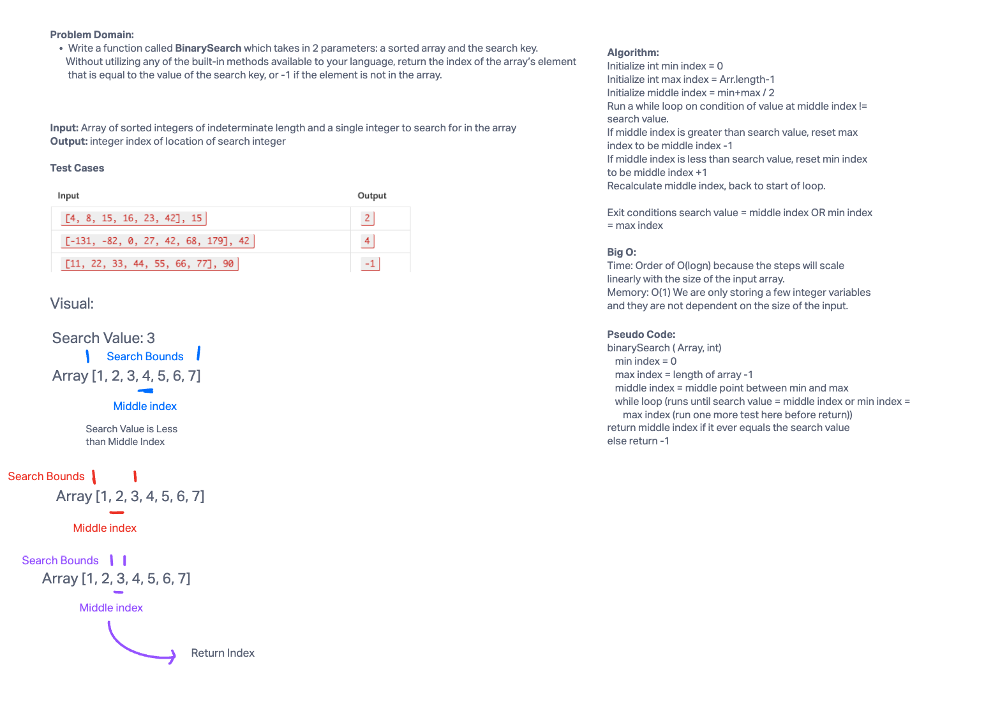

# Binary Search

Write a function called `BinarySearch` which takes in 2 parameters: a sorted array and the search key. Without utilizing any of the built-in methods available to your language, return the index of the array’s element that is equal to the value of the search key, or -1 if the element is not in the array.

## Whiteboard Process



## Approach & Efficiency

In order to use binary search on the array, I first set a minimum index and a maximum index.  Then I use simple division to find the middle point of the array and check it against the search value.  If it matches I return the index of the match.  If not, I check to see if it is larger or smaller and then reset the bounds of my search accordingly, always searching the mid point in a while loop.  Eventually if the min and max index are the same and the search value doesn't match middle index, then I know that the value does not exist in my array and I return -1.

For time, this function will be on the order of O(logn) because the algorithm divides the problem in half each time.  As the input scales, it will take logn longer to find a solution.

For memory, I am only storing three variables so it is constant in terms of space O(1).  As the input grows, I do not need any additional memory to store larger variables.

## Solution

```java
public static int binarySearch(int[] Arr, int SearchValue) {
    int minIndex = 0;
    int maxIndex = Arr.length-1;
    int middleIndex = (maxIndex + minIndex) /2;
    do {
      if (minIndex == maxIndex && Arr[middleIndex] != SearchValue) {
        return -1;
      } else if (Arr[middleIndex] == SearchValue) {
        return middleIndex;
      } else if (Arr[middleIndex] > SearchValue) {
        maxIndex = middleIndex - 1;
        middleIndex = (maxIndex + minIndex) /2;
      } else if (Arr[middleIndex] < SearchValue) {
        minIndex = middleIndex + 1;
        middleIndex = (maxIndex + minIndex) /2;
      }
    } while (true);
  }
  ```
