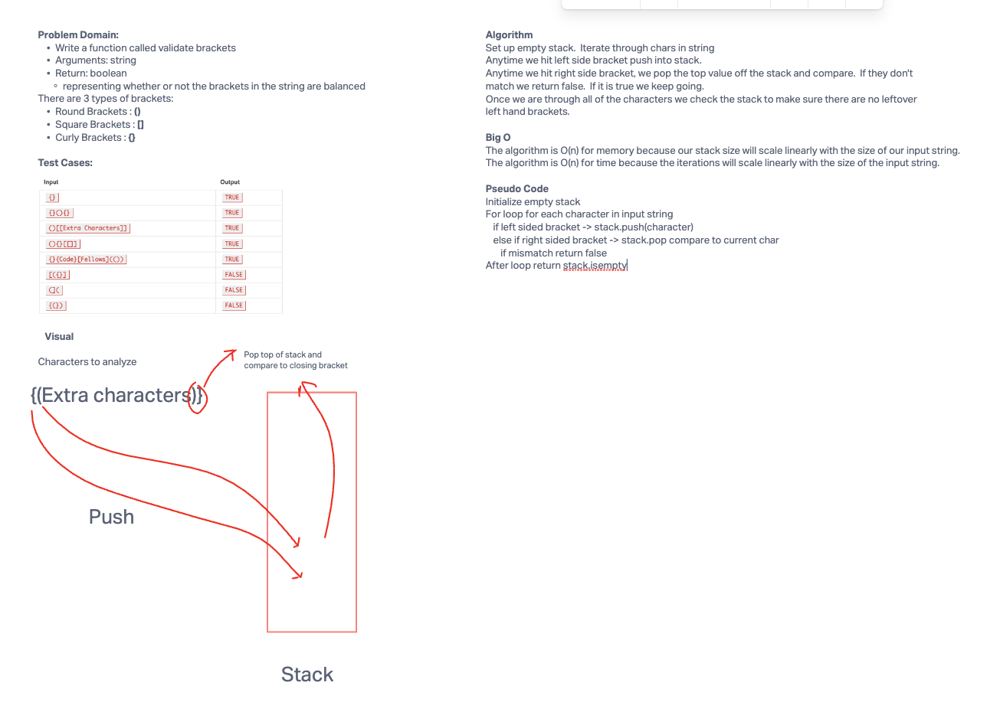

# Brackets
Write a function called validate brackets
- Arguments: string
- Return: boolean representing whether or not the brackets in the string are balanced

There are 3 types of brackets:

- Round Brackets : ()
- Square Brackets : []
- Curly Brackets : {}

## Whiteboard Process


## Approach & Efficiency

Any time we hit a left sided bracket we can push them into a comparison stack.
As long as we maintain order, anytime we hit a right sided bracket, the top of the stack
needs to match that character or else we have mismatching brackets.  Therefore we simply need
to compare the top of the stack (and pop it off the stack) to our current right sided character.
If we ever hit a mismatch we can return false.  At the end, our stack needs to be empty as well.

This function O(N) for both memory and time as it will scale linearly with the size of our input string.

## Solution
```java
public boolean validateBrackets(String string){
  Stack<Character> stack = new Stack<>();

  for (int i = 0; i < string.length(); i++){
    char currentChar = string.charAt(i);

    if (currentChar == '[' || currentChar == '{' || currentChar == '('){
      stack.push(currentChar);
    } else if (currentChar == ']' || currentChar == ')' || currentChar == '}') {
      if (stack.isEmpty()){
        return false;
      } else {
        char top = stack.pop();
        if ((currentChar == ']' && top != '[') || (currentChar ==')' && top != '(') || (currentChar == '}' && top != '{')){
          return false;
        }
      }
    }
  }
  return stack.isEmpty();
}

  ```
