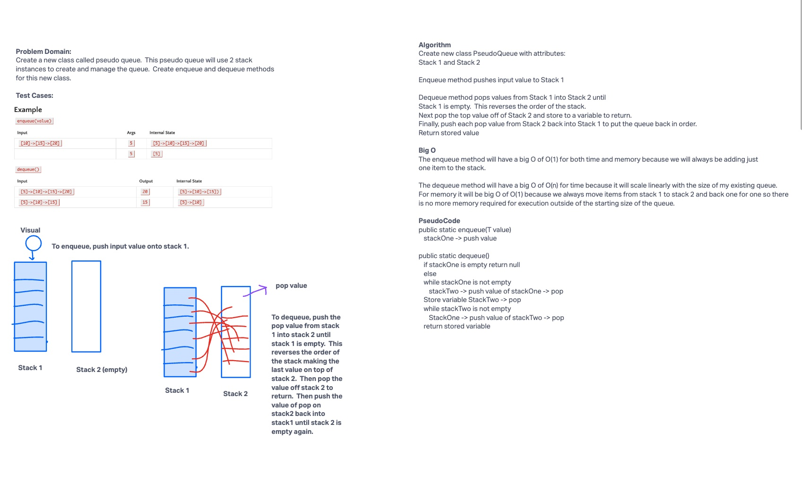

# PsuedoQueue
Create a new `PseudoQueue` class.  This class will use 2 stack instances to create and manage a queue.  Create enqueue and dequeue methods for this class.

## Whiteboard Process


## Approach & Efficiency

The PseudoQueue class has two attributes of stackOne and stackTwo.  StackOne is used for pushing values into the queue but because it is a FILO structure,
I need to use a second stack that will reverse the values when it is time to dequeue the bottom value from stackOne.  Every method is O(1) except
for my dequeue method for time because the time it takes will scale linearly with the size of my queue as I always need to pop every value individually
over into stackTwo and then pop all those values back into stack one.

## Solution
```java
public class PseudoQueue<T> {
    Stack<T> stackOne;
    Stack<T> stackTwo;

    public void enqueue(T value) {
        if (stackOne == null) {
            stackOne = new Stack<>();
        }
        stackOne.push(value);
    }

    public T dequeue() {
        if (stackOne.isEmpty() || stackOne == null) {
            throw new IllegalStateException("PseudoQueue is empty.  Can not dequeue.");
        }
        if (stackTwo == null) {
            stackTwo = new Stack<>();
        }
        while (!stackOne.isEmpty()) {
            stackTwo.push(stackOne.pop());
        }
        T dequeueVal = stackTwo.pop();
        while (!stackTwo.isEmpty()) {
            stackOne.push(stackTwo.pop());
        }
        return dequeueVal;
    }
}
  ```
