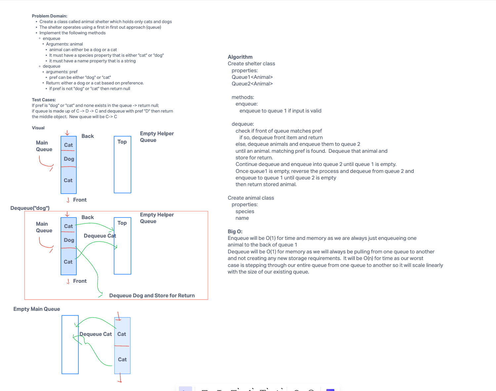

# Shelter
- Create a class called AnimalShelter which holds only dogs and cats.
- The shelter operates using a first-in, first-out approach.
- Implement the following methods:
  - enqueue
    - Arguments: animal
      - animal can be either a dog or a cat object.
      - It must have a species property that is either "cat" or "dog"
      - It must have a name property that is a string.
  - dequeue
    - Arguments: pref
      - pref can be either "dog" or "cat"
      - Return: either a dog or a cat, based on preference.
      - If pref is not "dog" or "cat" then return null.

## Whiteboard Process



## Approach & Efficiency

The shelter class is made up of two queues, queue1 and queue2.  All enqueueing happens to queue1 which represents our shelter queue.
When dequeue is called, assuming there are animals in queue, we check to see if the animal at the front of the line matches the preference.
If it does, we return the animal from the front of the queue.  If not, we dequeue animals into queue2 until we hit something matching the preference.
Once we have it, we dequeue and store it for later return.  Then we finish dequeueing queue1 into queue2.  Then we dequeue everything from queue2 back into queue 1
keeping the same order.

For Big O, everything is O(1) except for dequeue which will be O(n) for time as in our worst case we will need to dequeue everything in queue1 so it
scales linearly on time with the size of the existing queue.


## Solution
```java
public class Shelter {
  Queue<Animal> queue1;
  Queue<Animal> queue2;

  public Shelter(Queue<Animal> queue1, Queue<Animal> queue2) {
    this.queue1 = queue1;
    this.queue2 = queue2;
  }

  public void enqueue(Animal animal){
    if (!animal.species.equals("dog") && !animal.species.equals("cat")){
      throw new IllegalArgumentException("Animal must be of species dog or cat");
    }
    queue1.enqueue(animal);
  }

  public Animal dequeue(String pref) {
    if (queue1 == null){
      throw new IllegalStateException("Shelter is empty, can't dequeue.");
    } else if (queue1.peek() == null) {
      throw new IllegalStateException("Shelter is empty, can't dequeue.");
    }
    if (queue1.peek().species.equals(pref)){
      return queue1.dequeue();
    } else {
      while(!queue1.peek().species.equals(pref) && !queue1.isEmpty()){
        queue2.enqueue(queue1.dequeue());
      }
      if (queue1.isEmpty()){
        while(!queue2.isEmpty()){
          queue1.enqueue(queue2.dequeue());
        }
        return null;
      }
      Animal returnAnimal = queue1.dequeue();
      while (!queue1.isEmpty()){
        queue2.enqueue(queue1.dequeue());
      }
      while (!queue2.isEmpty()){
        queue1.enqueue(queue2.dequeue());
      }
      return returnAnimal;
    }
  }
}

  ```
