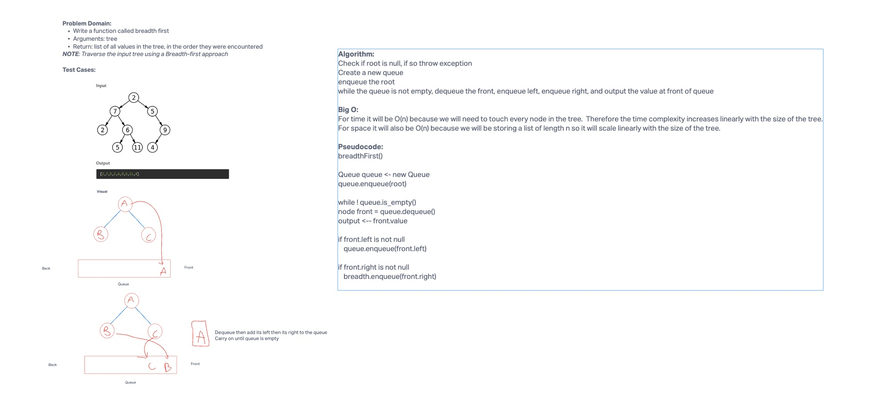

# Breadth First

- Write a function called breadth first
- Arguments: tree
- Return: list of all values in the tree, in the order they were encountered

## Whiteboard Process



## Approach & Efficiency

First I check to see if the tree root is null and if so throw an exception.  Then I create an empty array list for my output and an empty queue.  Then I put the root in the queue.
Next I run a while loop that operates until the queue is empty.  Each iteration dequeues the front of the queue, puts its value in the array, then enqueues its left and right nodes.
This runs until the queue is empty then i return the array list.

This will have a run time of O(n) as it will need to hit every single node in our tree.
For space this will be O(n) as our arrayList will grow linearly with the size of the tree.


## Solution
```java
  public List<Integer> breadthFirst(){
    if (root == null){
      throw new IllegalArgumentException("the tree is empty");
    }
    List<Integer> values = new ArrayList<>();
    Queue<Node> queue = new Queue();
    queue.enqueue(root);

    while (!queue.isEmpty()){
      Node front = queue.dequeue();
      values.add(front.value);
      if (front.left != null){
        queue.enqueue(front.left);
      } else if (front.right != null){
        queue.enqueue(front.right);
      }
    }
    return values;
  }

  ```
