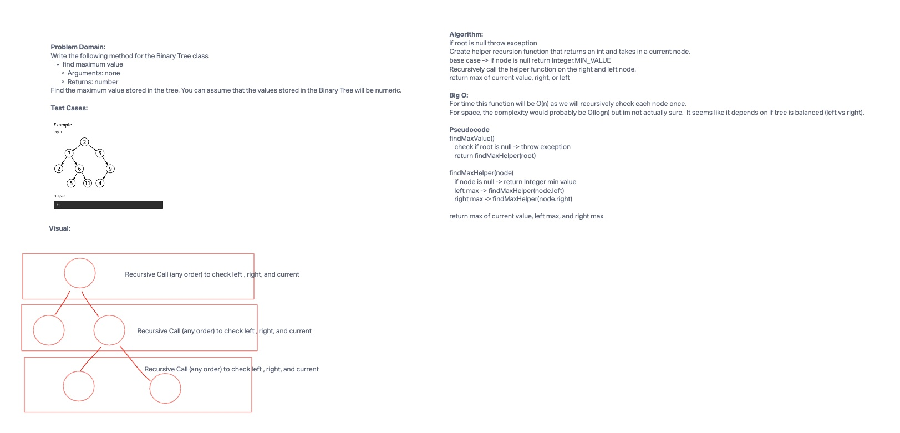

# Find Max
Write the following method for the Binary Tree class

- find maximum value
  - Arguments: none
  - Returns: number

Find the maximum value stored in the tree. You can assume that the values stored in the Binary Tree will be numeric.

## Whiteboard Process



## Approach & Efficiency

In order to find the maximum value, I call a recursive function that always returns the largest value
from either the current value, the left branch, or the right branch.  This will recursively call until it hits the base case of
current node == null.

This will have a run time of O(n) as it will need to hit every single node in our tree.
For space, I don't fully know what the worst case would be.  I suppose I would need to understand how the recursive calls impact the call stack and how
that is influenced by the trees height and shape.


## Solution
```java
  public int findMax(){
    if (root == null){
      throw new IllegalArgumentException("The tree is empty");
    }
    return findMaxHelper(root);
  }

  public Integer findMaxHelper(Node current){
    if (current == null) return Integer.MIN_VALUE;
    Integer leftMax = findMaxHelper(current.left);
    Integer rightMax = findMaxHelper(current.right);

    if(current.value >= leftMax && current.value >= rightMax){
      return current.value;
    } else if (leftMax >= current.value && leftMax >= rightMax){
      return leftMax;
    } else {
      return rightMax;
    }
  }

  ```
