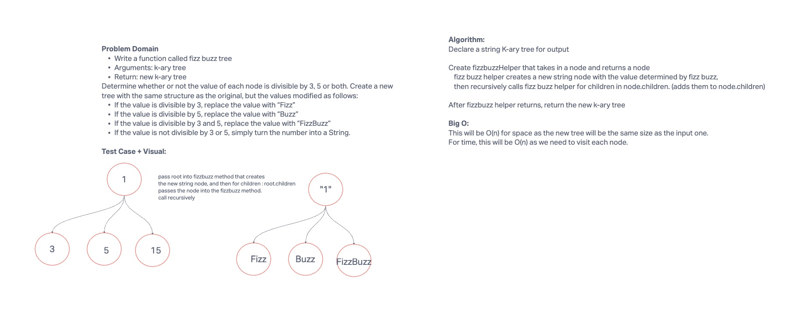

# Fizz Buzz K-Ary Tree

Write a function called fizz buzz tree
Arguments: k-ary tree
Return: new k-ary tree
Determine whether or not the value of each node is divisible by 3, 5 or both. Create a new tree with the same structure as the original, but the values modified as follows:

If the value is divisible by 3, replace the value with “Fizz”
If the value is divisible by 5, replace the value with “Buzz”
If the value is divisible by 3 and 5, replace the value with “FizzBuzz”
If the value is not divisible by 3 or 5, simply turn the number into a String.

## Whiteboard Process



## Approach & Efficiency

I set up a helper function that determines the output value based on an input integer complying with the fizz buzz rules.  I also create a function that returns a node and is
passed in a root node.  This function creates a new string node and then recursively calls itself for all of its children nodes.  What will be returned is the root of the modified tree.

This modified tree will be O(n) for space because it is the same size as the input tree.  The function will also be called once for each node so it will be O(n) for time as well.


## Solution
```java
  public static KaryNode<String> fizzBuzzTree(KaryNode<Integer> root){
    if (root == null) {return null;}
    KaryNode<String> newNode = new KaryNode<>(getFizzBuzzValue(root.getValue()));
    for (KaryNode<Integer> child : root.children) {
      newNode.children.add(fizzBuzzTree(child));
    }
    return newNode;
  }

  public static String getFizzBuzzValue(int value) {
    if (value % 3 == 0 && value % 5 == 0) {
      return "FizzBuzz";
    } else if (value % 3 == 0) {
      return "Fizz";
    } else if (value % 5 == 0) {
      return "Buzz";
    } else {
      return String.valueOf(value);
    }
  }


  ```
