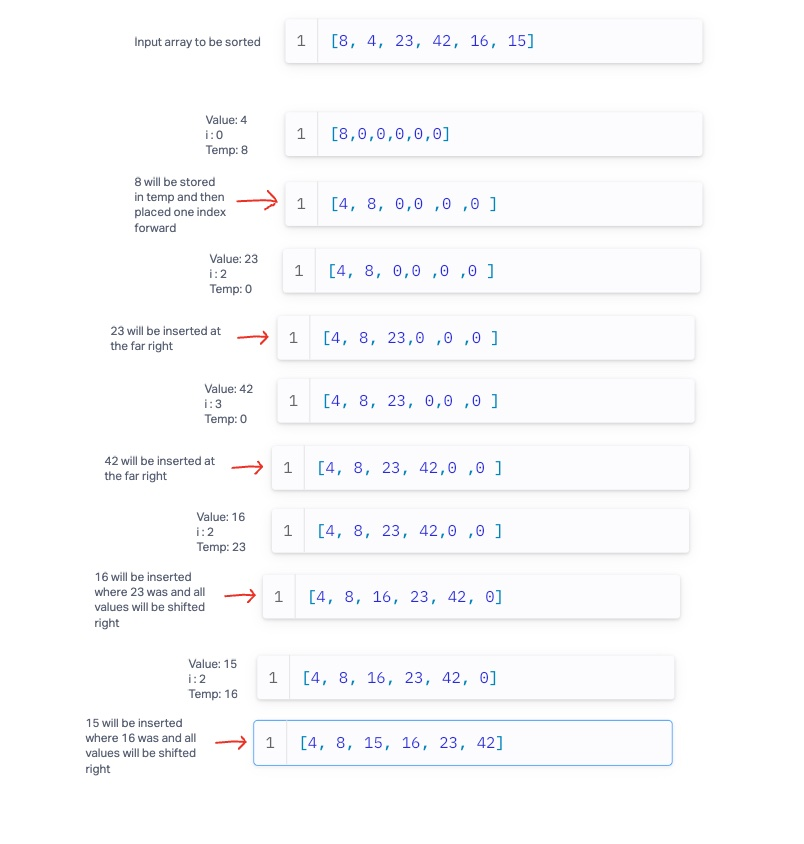

# Insertion Sort Code Challenge

## PseudoCode

```agsl
Insert(int[] sorted, int value)
  initialize i to 0
  WHILE value > sorted[i]
    set i to i + 1
  WHILE i < sorted.length
    set temp to sorted[i]
    set sorted[i] to value
    set value to temp
    set i to i + 1
  append value to sorted

InsertionSort(int[] input)
  LET sorted = New Empty Array
  sorted[0] = input[0]
  FOR i from 1 up to input.length
    Insert(sorted, input[i])
  return sorted
```

## Explanation

Each time Insert gets called, the method will find the first index in the sorted array where the input value is smaller than the existing value.
At this point, the method will store the value at that index in the sorted array to a temporary variable, insert the new value, then iteratively shift
each subsequent value one spot right.  This process will repeat until the entire array has been sorted.



