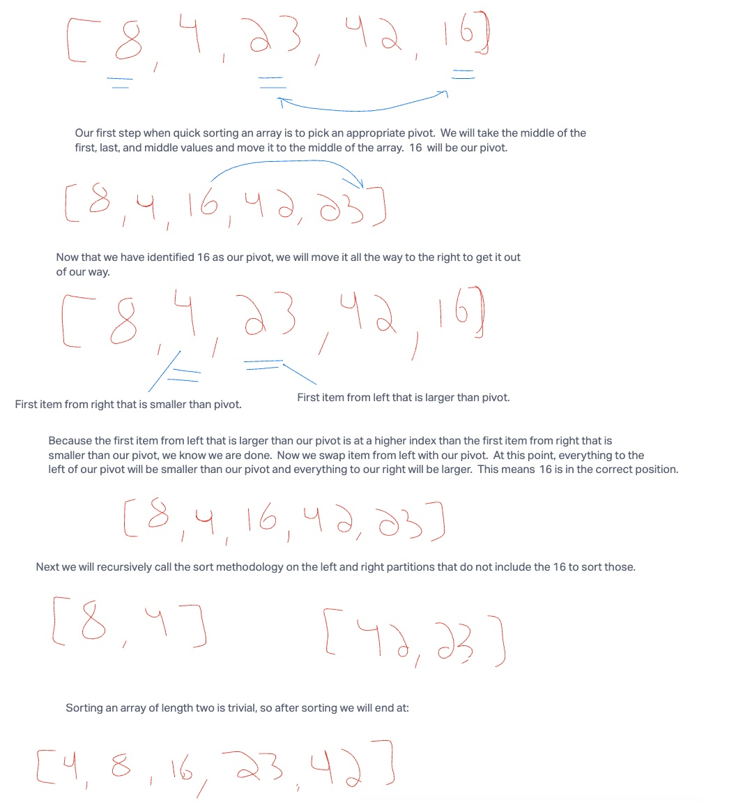

# Quick Sort Code Challenge

## Big O

For quick sort, the worst case will be O(n^2), but it can be reduced to O(nlogn) on average with the addition of method to pick an appropriate pivot.
The Big O for memory will be O(1) as we only need to create a few variables that do not scale with the size of the input.
