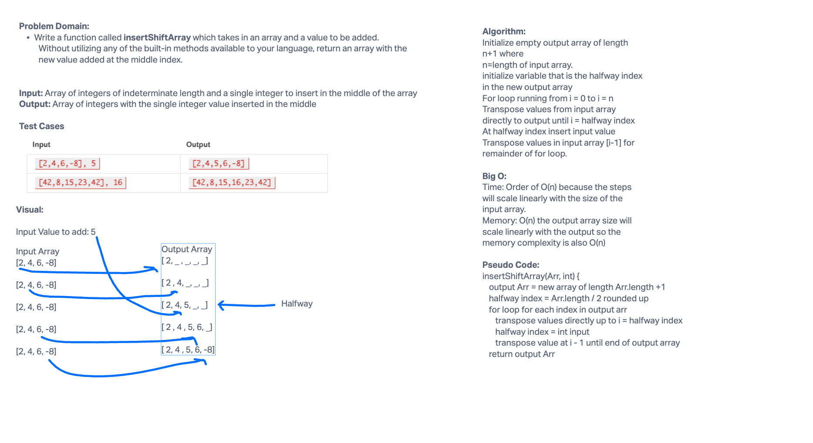

# Insert Shift Array

Write a function called `insertShiftArray` which takes in an array and a value to be added. Without utilizing any of the built-in methods available to your language, return an array with the new value added at the middle index.

## Whiteboard Process


## Approach & Efficiency

The approach I took looking at the input output examples was to set a middle index equal to input array / 2 rounded up.  Then I created an output array of length inputArr.length + 1.  I then do a for loop through the indices of the output array, directly transposing through the halfway point.  I insert the input value at the halfway point.  Then I transpose with a shift of one index for the rest of the array.

This method will have a big O of O(n) for time and memory because the steps will scale linearly with the size of the input array.  Also because I am creating a new output array of length n+1, it will have an O(n) for memory as well.

## Solution
```java
public static int[] insertShiftArray(int[] Arr, int num) {
    int mid = (int) Math.ceil(Arr.length /2.0);
    int[] newArr = new int[Arr.length + 1];
    for (int i = 0; i < newArr.length; i++) {
      if (i < mid){
        newArr[i]=Arr[i];
      } else if (i == mid){
        newArr[i] = num;
      } else {
        newArr[i] = Arr[i-1];
      }
    }
    return newArr;
  }
  ```
