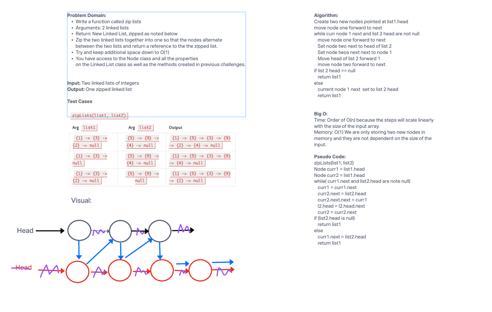

# Zip Lists
Write a function called `zipLists` which takes in two linked lints and returns a new linked list zipped together.  Zip the two lists so the nodes alternate between the two lists and return a reference to the zipped list.

## Whiteboard Process


## Approach & Efficiency

My approach on the whiteboard itself was intended to create two iterators on list 1 and just keep moving the head forward in list 2.  During implementation I found this solution unwieldy so my code reflects a different solution.  In both cases, my intent was to use reference nodes to stop from creating a new linked list which would expand the big O on memory for my solution.  The approach below modifies list1 in place and therefore does not have a return.

## Solution
```java
    public static void zipLists(LinkedList<Integer> list1, LinkedList<Integer> list2) {
        Node<Integer> curr1 = list1.head;
        Node<Integer> curr2 = list2.head;
        Node<Integer> prev = null;

        while (curr1 != null && curr2 != null) {
            Node<Integer> next1 = curr1.next;
            Node<Integer> next2 = curr2.next;

            curr1.next = curr2;
            curr2.next = next1;

            prev = curr1;
            curr1 = next1;
            curr2 = next2;
        }

        if (curr1 != null) {
            curr1.next = curr2;
        } else {
            curr2.next = curr1;
        }
    }
  ```
